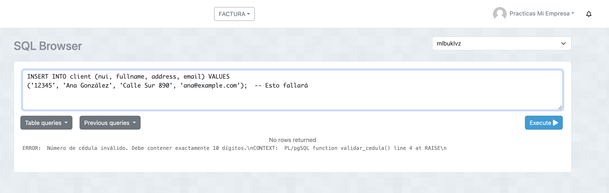
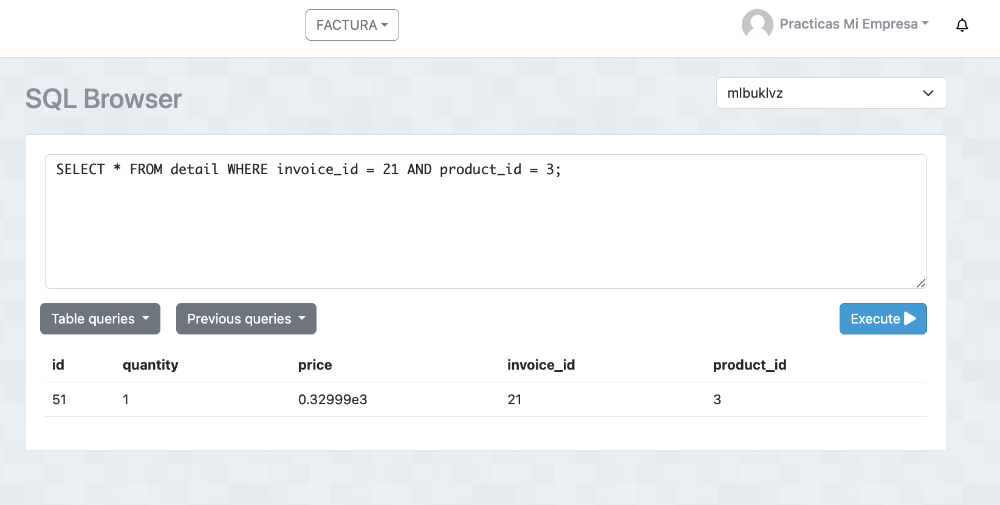
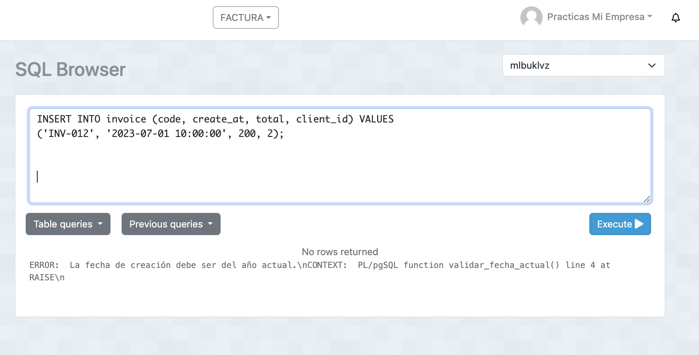
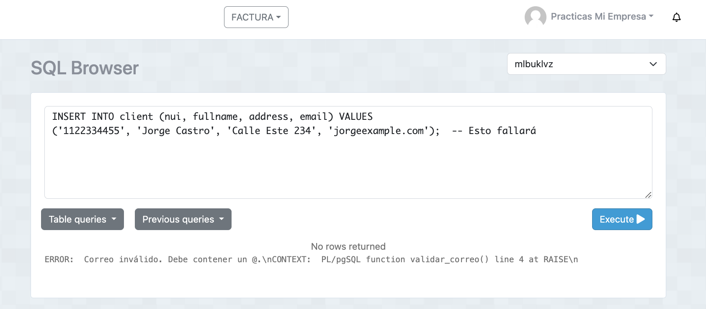

# function-trigger

## 1. Validar que el número de cédula del cliente tenga 10 números (no letras) en la tabla client.

- Sentencia:Función para validar número de cédula
  ```
  CREATE OR REPLACE FUNCTION validar_cedula() RETURNS TRIGGER AS $$
BEGIN
    IF LENGTH(NEW.nui) != 10 OR NEW.nui ~ '[^0-9]' THEN
        RAISE EXCEPTION 'Número de cédula inválido. Debe contener exactamente 10 dígitos.';
    END IF;
    RETURN NEW;
END;
$$ LANGUAGE plpgsql;

- Trigger 
CREATE TRIGGER validar_cedula_trigger
BEFORE INSERT OR UPDATE ON client
FOR EACH ROW
EXECUTE FUNCTION validar_cedula();

  ```
 - Captura:



 ## 2. Disminuir el stock de la tabla product cada vez que se inserte un nuevo registro en la tabla detail.

- Sentencia:Función para disminuir stock
  ```
  CREATE OR REPLACE FUNCTION dis_stock() RETURNS TRIGGER AS $$
BEGIN
    -- Actualizar el stock del producto
    UPDATE product
    SET stock = stock - NEW.quantity
    WHERE id = NEW.product_id;

    -- Verificar si el stock es insuficiente
    IF (SELECT stock FROM product WHERE id = NEW.product_id) < 0 THEN
        RAISE EXCEPTION 'Stock insuficiente para el producto %', NEW.product_id;
    END IF;

    RETURN NEW;
END;
$$ LANGUAGE plpgsql;

-- Trigger 

CREATE TRIGGER dis_stock_trigger
AFTER INSERT ON detail
FOR EACH ROW
EXECUTE PROCEDURE dis_stock();

  ```
 - Captura:


 
 
## 3. Validar que el campo create_at de la tabla invoice sea del año actual.

- Sentencia:Función para validar el año de la fecha
  ```
  CREATE OR REPLACE FUNCTION validar_fecha_actual() RETURNS TRIGGER AS $$
BEGIN
    IF EXTRACT(YEAR FROM NEW.create_at) != EXTRACT(YEAR FROM CURRENT_DATE) THEN
        RAISE EXCEPTION 'La fecha de creación debe ser del año actual.';
    END IF;
    RETURN NEW;
END;
$$ LANGUAGE plpgsql;

-- Trigger 
CREATE TRIGGER validar_fecha_actual_trigger
BEFORE INSERT OR UPDATE ON invoice
FOR EACH ROW
EXECUTE PROCEDURE validar_fecha_actual();

  ```
 - Captura:



## 4. Validar que el correo del cliente tenga un @.

- Sentencia: Función para validar el correo
  ```
 CREATE OR REPLACE FUNCTION validar_correo() RETURNS TRIGGER AS $$
BEGIN
    IF POSITION('@' IN NEW.email) = 0 THEN
        RAISE EXCEPTION 'Correo inválido. Debe contener un @.';
    END IF;
    RETURN NEW;
END;
$$ LANGUAGE plpgsql;

-- Trigger 
CREATE TRIGGER validar_correo_trigger
BEFORE INSERT OR UPDATE ON client
FOR EACH ROW
EXECUTE PROCEDURE validar_correo();

  ```
 - Captura:

